# 🎮2048 Game Engine – CLI to Cloud 🚀
A personal childhood favorite turned into a full-fledged backend engineering journey — layer by layer — from a command-line Java game to a cloud-deployable REST API. This project showcases the full development lifecycle using Java and Spring Boot, containerization with Docker, and deployment using Kubernetes on Minikube.

## 🛠️ Tech Stack

- **Java 17** – Core language for game logic and backend API
- **Spring Boot** – Framework to expose 2048 as a REST API  
- **Maven** – Project build and dependency management  
- **REST API** – To start games, make moves, and fetch status  
- **Docker** – Containerization for consistent deployment  
- **Kubernetes (Minikube)** – For orchestrating containers locally  
- **Postman** – API testing and simulation  

## 🎯 Features

- Built an initial **CLI version** of the 2048 game in Java, then refactored it into a **modular, testable game engine**  
- Converted the CLI game into a **Spring Boot REST API**  
- Implemented endpoints to:  
  - Start a new game session  
  - Make directional moves (up, down, left, right)  
  - Fetch game status and current score  
- Used **Maven** to manage dependencies and package the app into a `.jar` file  
- **Tested API functionality** and gameplay flow using **Postman**  
- **Containerized** the application using **Docker**, and published the image to **Docker Hub** as part of exploring real-world deployment workflows.  
  - Docker Image: [`suhritareddy/game2048-api`](https://hub.docker.com/r/suhritareddy/game2048-api)  
- **Deployed** the app locally using **Kubernetes (Minikube)**  
- Managed **stateful game sessions** using unique game IDs  
- Explored and demonstrated the complete journey from **CLI to Cloud** using modern DevOps practices

### 📸 CLI Game Showcase

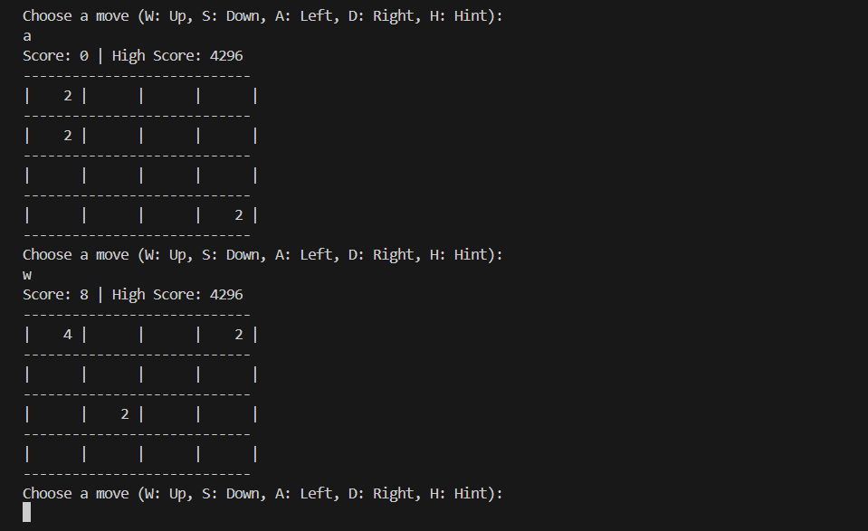
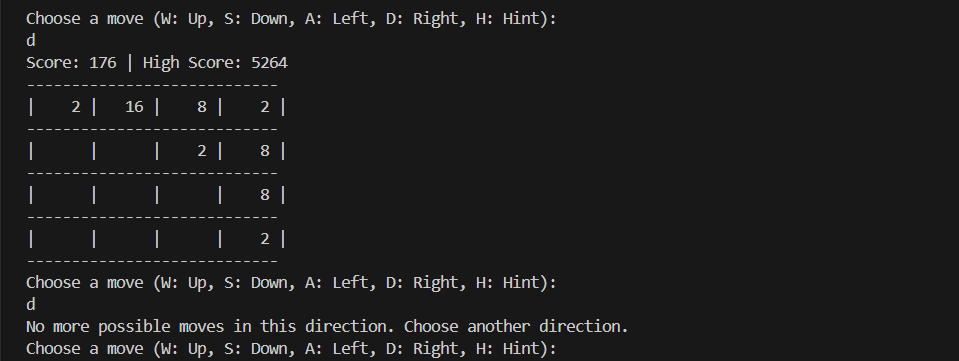
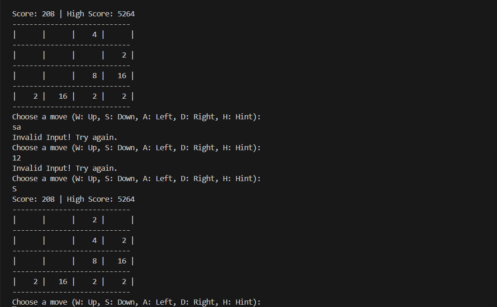
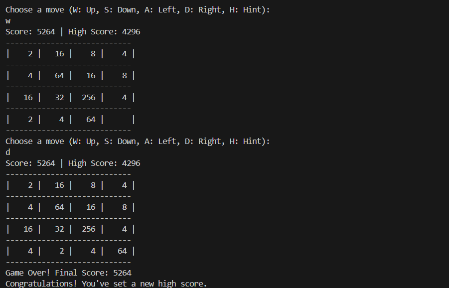


## 📦 API Endpoints

| Endpoint                                  | Method | Description                                                                |
|-------------------------------------------|--------|----------------------------------------------------------------------------|
| `/game/start`                             | POST   | Starts a new game and returns a unique game ID                             |
| `/move?gameId={id}&direction={dir}`       | POST   | Makes a move (`up`, `down`, `left`, `right`) in the specified game session |
| `/state?gameId={id}`                      | GET    | Fetches the current game board and score for the given game session        |

---

### 🔄 Example Usage:
```http
POST http://localhost:8080/game/start

POST http://localhost:8080/move?gameId=123&direction=left

GET  http://localhost:8080/state?gameId=123
```

## 🔧 How to Run Locally:

### 1️⃣ Clone the repository:
``` bash
git clone https://github.com/your-username/2048-cli-to-cloud.git
cd 2048-cli-to-cloud
```
### 2️⃣ Build the project using Maven:
```bash
./mvnw clean package
```
- This will generate .jar file in the target/ directory

### 🧱 Maven Build Output

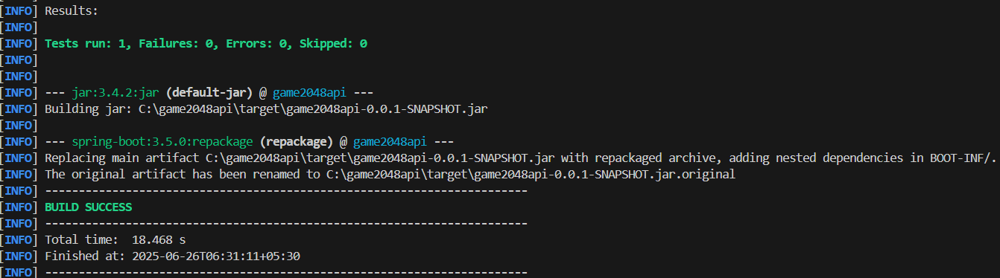


### 3️⃣ Run the application:
```
java -jar target/game2048api-0.0.1-SNAPSHOT.jar
```

## 🐳 Run with Docker 
✅ Prerequisites:
- docker should be installed and running

### 1️⃣ Build the Docker image
```
docker build -t 2048-game-api .
```
### 2️⃣ Run the Docker container
```
docker run -p 8080:8080 2048-game-api
```
--The API will be available at: http://localhost:8080

### 🐋 Docker Build & Run

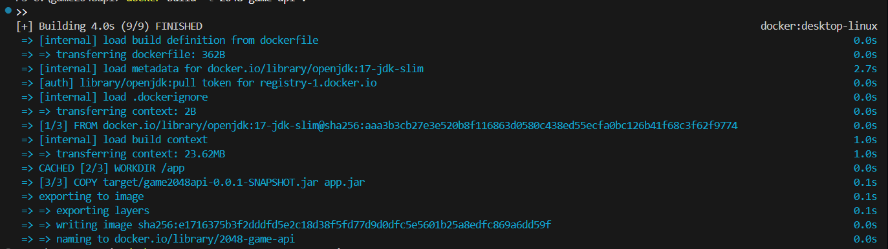  
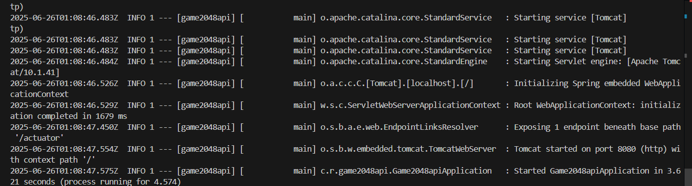
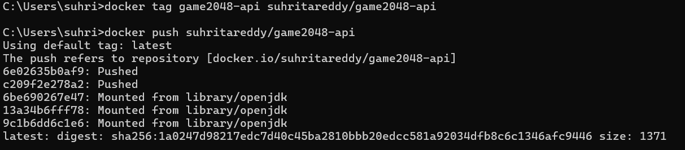

### 📦 DockerHub Repository

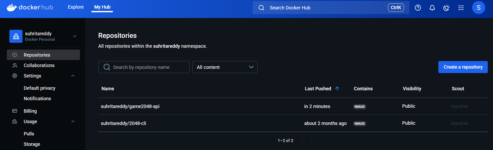


### 3️⃣ Test the API locally using Postman or browser
```
Start a game:
POST http://localhost:8080/game/start

Make a move:
POST http://localhost:8080/move?gameId=123&direction=left
-instead of left you can give the move you want to

Check status:
GET http://localhost:8080/state?gameId=123
```

## ☸️ Deploy on Kubernetes (Minikube)
✅ Prerequisites:
-minikube installed and running
-docker image was pushed to docker hub

### 1️⃣ Start Minikube
```bash
minikube start
```
### 2️⃣ Apply Kubernetes Deployment & Service
```
kubectl apply -f k8s/deployment.yaml
kubectl apply -f k8s/service.yaml
```
### 3️⃣ Expose the service and get the URL
```
minikube service game2048-service --url
```
- This will give you a local URL like http://127.0.0.1:XXXX where API will be accessible.

### ☸️ Kubernetes Deployment

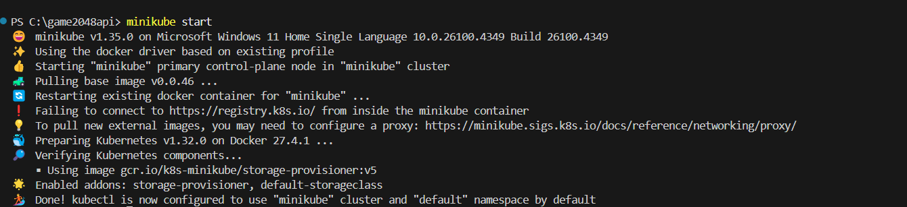  
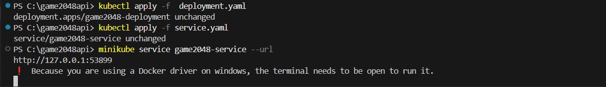  

### 📬 Postman API Testing (Kubernetes)

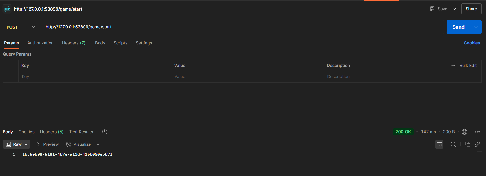 
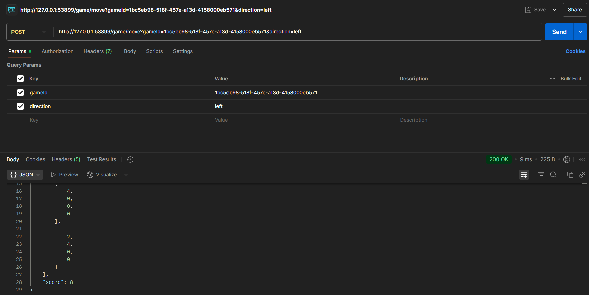
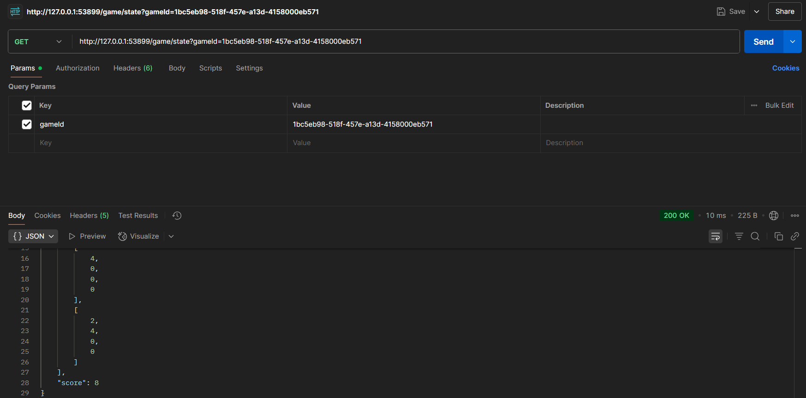


## 📚 What I Learned

-Started with a simple CLI version of 2048 and turned it into a modular Java project
-Learned how to design and expose RESTful APIs using Spring Boot
-Understood Maven fundamentals for managing dependencies and packaging the application into an executable JAR
-Containerized the app with Docker and published it to Docker Hub
-Explored Kubernetes using Minikube to deploy and manage containers locally
-Tested all API endpoints and game flows using Postman to validate functionality
-Most importantly, gained a clear understanding of the full journey from development to deployment — the core goal of this project

## ✨ Future Improvements

-Integrate a database to persist game state and history (earlier handled via file storage in the CLI version)
-Build a simple frontend interface to play 2048 through the browser
-Add user authentication to track individual game sessions and high scores
-Explore the endgame by setting up basic CI/CD using GitHub Actions for automated builds and tests

